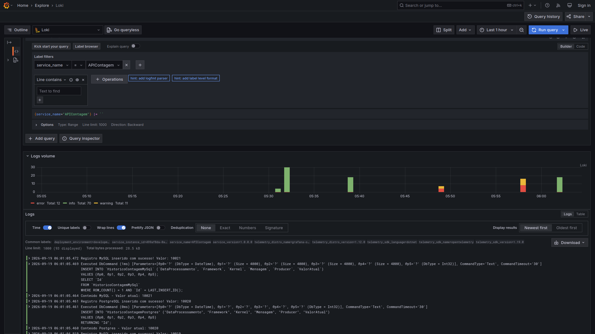
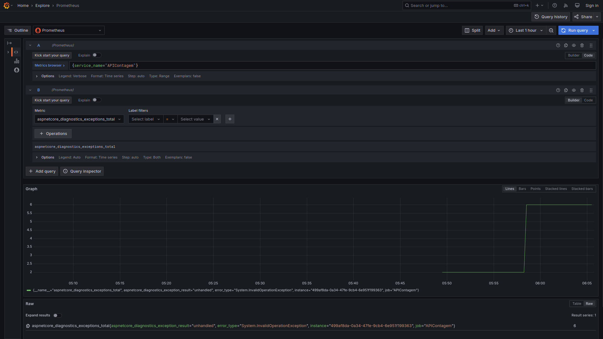
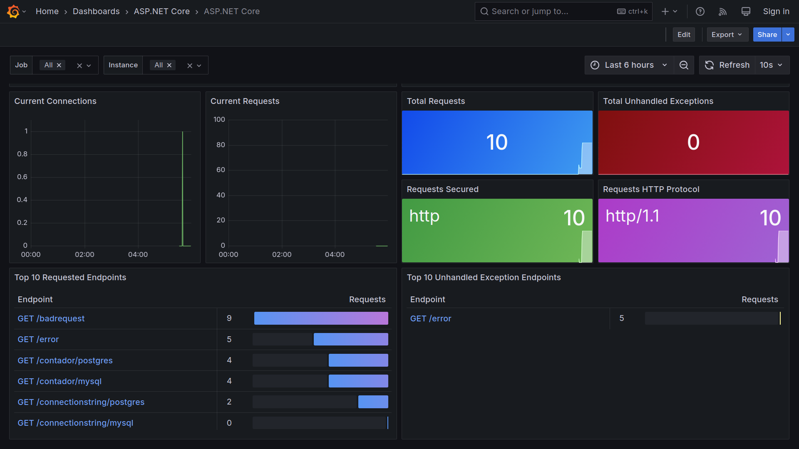

# aspnetcore10-otel-grafana-tempo-loki-prometheus-postgres-mysql-testcontainers_contagemacessos
Exemplo de uso de OpenTelemetry + Grafana + Tempo (trace) + Loki (logs) + Prometheus (métricas) em uma API REST de contagem de acessos baseada em .NET 10 + ASP.NET Core e que utiliza bases de dados PostgreSQL + MySql + Testcontainers. Inclui um script do Docker Compose para criação do ambiente de testes.

## Testes

Trace no Grafana Tempo:

Logs no Grafana Loki:

Visualizando uma métrica no Prometheus:

Dashboard do ASP.NET Core com alguns testes dos diferentes endpoints:

